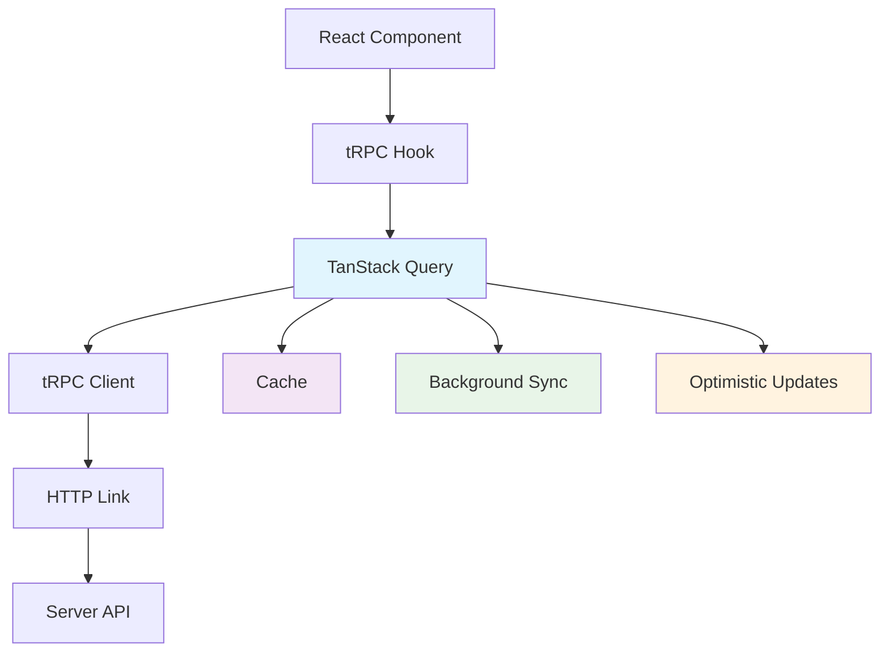

tRPC Client provides fully typesafe API calls with automatic TypeScript inference, excellent DX, and seamless integration with popular frontend frameworks.

## What is tRPC Client?

tRPC Client is the frontend portion of tRPC that handles:

- **Type-Safe API Calls**: Automatic TypeScript inference for all API interactions
- **Framework Integration**: First-class support for React, Next.js, and other frameworks
- **Caching & State Management**: Built-in integration with TanStack Query for optimal UX
- **Error Handling**: Structured error handling with proper TypeScript types
- **Real-time Features**: Support for subscriptions and WebSocket connections

## Core Features

<Cards>
  <Card
    icon={<IconShield className="text-blue-500" />}
    title="End-to-End Type Safety"
  >
    Get full TypeScript autocompletion and type checking from server to client.
  </Card>

<Card icon={<IconRefresh className="text-green-500" />} title="Smart Caching">
  Built-in integration with TanStack Query for caching, background updates, and
  optimistic updates.
</Card>

<Card
  icon={<IconPuzzle className="text-purple-500" />}
  title="Framework Agnostic"
>
  Use with React, Next.js, or any JavaScript framework with our flexible client
  adapters.
</Card>

  <Card icon={<IconBolt className="text-orange-500" />} title="Exceptional DX">
    Full autocomplete, go-to-definition, and refactoring that works across your
    entire stack.
  </Card>
</Cards>

## Client Integrations

### React with TanStack Query (Recommended)

The most powerful way to use tRPC in React applications:

```typescript title="utils/trpc.ts"
import { createTRPCReact } from '@trpc/react-query';
import type { AppRouter } from '../server/router';

export const trpc = createTRPCReact<AppRouter>();
```

```typescript title="app/layout.tsx"
'use client';
import { QueryClient, QueryClientProvider } from '@tanstack/react-query';
import { httpBatchLink } from '@trpc/client';
import { useState } from 'react';
import { trpc } from '../utils/trpc';

export default function RootLayout({
  children,
}: {
  children: React.ReactNode;
}) {
  const [queryClient] = useState(() => new QueryClient());
  const [trpcClient] = useState(() =>
    trpc.createClient({
      links: [
        httpBatchLink({
          url: '/api/trpc',
        }),
      ],
    })
  );

  return (
    <html>
      <body>
        <trpc.Provider client={trpcClient} queryClient={queryClient}>
          <QueryClientProvider client={queryClient}>
            {children}
          </QueryClientProvider>
        </trpc.Provider>
      </body>
    </html>
  );
}
```

### Usage in Components

<Tabs items={['Queries', 'Mutations', 'Optimistic Updates']}>
  <Tab value="Queries">
    ```typescript title="components/UserProfile.tsx"
    export function UserProfile({ userId }: { userId: string }) {
      const userQuery = useQuery(
        trpc.users.getById.queryOptions(userId)
      );
      
      if (userQuery.isLoading) return <div>Loading...</div>;
      if (userQuery.error) return <div>Error: {userQuery.error.message}</div>;
      
      return (
        <div>
          <h1>{userQuery.data.name}</h1>
          <p>{userQuery.data.email}</p>
        </div>
      );
    }
    ```
  </Tab>
  
  <Tab value="Mutations">
    ```typescript title="components/CreateUser.tsx"
    export function CreateUser() {
      const utils = trpc.useUtils();
      
      const createUserMutation = useMutation(
        trpc.users.create.mutationOptions({
          onSuccess: () => {
            // Invalidate and refetch users list
            utils.users.list.invalidate();
          },
        })
      );
      
      return (
        <form onSubmit={(e) => {
          e.preventDefault();
          const formData = new FormData(e.currentTarget);
          createUserMutation.mutate({
            name: formData.get('name') as string,
            email: formData.get('email') as string,
          });
        }}>
          <input name="name" placeholder="Name" required />
          <input name="email" type="email" placeholder="Email" required />
          <button type="submit" disabled={createUserMutation.isPending}>
            {createUserMutation.isPending ? 'Creating...' : 'Create User'}
          </button>
        </form>
      );
    }
    ```
  </Tab>
  
  <Tab value="Optimistic Updates">
    ```typescript title="components/TodoList.tsx"
    export function TodoList() {
      const utils = trpc.useUtils();
      
      const toggleTodoMutation = useMutation(
        trpc.todos.toggle.mutationOptions({
          onMutate: async ({ id }) => {
            // Cancel outgoing refetches
            await utils.todos.list.cancel();
            
            // Snapshot the previous value
            const previousTodos = utils.todos.list.getData();
            
            // Optimistically update
            utils.todos.list.setData(undefined, (old) =>
              old?.map(todo => 
                todo.id === id 
                  ? { ...todo, completed: !todo.completed }
                  : todo
              )
            );
            
            return { previousTodos };
          },
          onError: (err, variables, context) => {
            // Rollback on error
            utils.todos.list.setData(undefined, context?.previousTodos);
          },
          onSettled: () => {
            // Always refetch after error or success
            utils.todos.list.invalidate();
          },
        })
      );
      
      // ... component logic
    }
    ```
  </Tab>
</Tabs>

## Client Architecture



## Framework Integrations

<Accordion type="multiple">
  <AccordionItem value="nextjs">
    <AccordionTrigger>Next.js Integration</AccordionTrigger>
    <AccordionContent>
      Full-stack integration with Next.js including SSR, SSG, and API routes.
      
      ```typescript
      // pages/api/trpc/[trpc].ts
      import { createNextApiHandler } from '@trpc/server/adapters/next';
      import { appRouter } from '~/server/router';
      
      export default createNextApiHandler({
        router: appRouter,
        createContext,
      });
      ```
    </AccordionContent>
  </AccordionItem>
  
  <AccordionItem value="react">
    <AccordionTrigger>React Integration</AccordionTrigger>
    <AccordionContent>
      Use tRPC with any React application using our React Query integration.
      
      ```typescript
      import { createTRPCReact } from '@trpc/react-query';
      
      export const trpc = createTRPCReact<AppRouter>();
      ```
    </AccordionContent>
  </AccordionItem>
  
  <AccordionItem value="vanilla">
    <AccordionTrigger>Vanilla Client</AccordionTrigger>
    <AccordionContent>
      Use tRPC without any framework dependencies for maximum flexibility.
      
      ```typescript
      import { createTRPCClient, httpBatchLink } from '@trpc/client';
      
      const client = createTRPCClient<AppRouter>({
        links: [httpBatchLink({ url: '/api/trpc' })],
      });
      
      const result = await client.users.getById.query('123');
      ```
    </AccordionContent>
  </AccordionItem>
</Accordion>

## Advanced Features

### Infinite Queries

Perfect for pagination and infinite scrolling:

```typescript
const postsQuery = useInfiniteQuery(
  trpc.posts.infiniteList.infiniteQueryOptions({
    getNextPageParam: (lastPage) => lastPage.nextCursor,
  }),
);
```

### Subscriptions

Real-time data with WebSockets or Server-Sent Events:

```typescript
const subscription = trpc.messages.onAdd.useSubscription(
  { channelId: 'general' },
  {
    onData: (message) => {
      console.log('New message:', message);
    },
  },
);
```

### Custom Links

Customize how requests are sent to your server:

```typescript
const client = trpc.createClient({
  links: [
    loggerLink(),
    splitLink({
      condition: (op) => op.type === 'subscription',
      true: wsLink({ client: wsClient }),
      false: httpBatchLink({ url: '/api/trpc' }),
    }),
  ],
});
```

## Error Handling

tRPC provides structured error handling with full TypeScript support:

```typescript
const userQuery = useQuery(trpc.users.getById.queryOptions(userId));

if (userQuery.error) {
  // error is fully typed based on your server's error format
  switch (userQuery.error.data?.code) {
    case 'NOT_FOUND':
      return <div>User not found</div>;
    case 'UNAUTHORIZED':
      return <div>Please log in</div>;
    default:
      return <div>Something went wrong</div>;
  }
}
```

## Next Steps

<Cards>
  <Card title="React Integration" href="/docs/client/tanstack-react-query">
    Get started with tRPC and TanStack Query in React
  </Card>

<Card title="Next.js Setup" href="/docs/client/nextjs">
  Full-stack tRPC with Next.js SSR and API routes
</Card>

<Card title="Configuration" href="/docs/client/links">
  Customize your client with links and middleware
</Card>

  <Card title="Error Handling" href="/docs/client/error-handling">
    Handle errors gracefully with proper TypeScript types
  </Card>
</Cards>

<Callout title="New to tRPC?">
  Start with our [Framework overview](/docs/framework) to understand the core
  concepts, then dive into server-side implementation before setting up your
  client.
</Callout>
