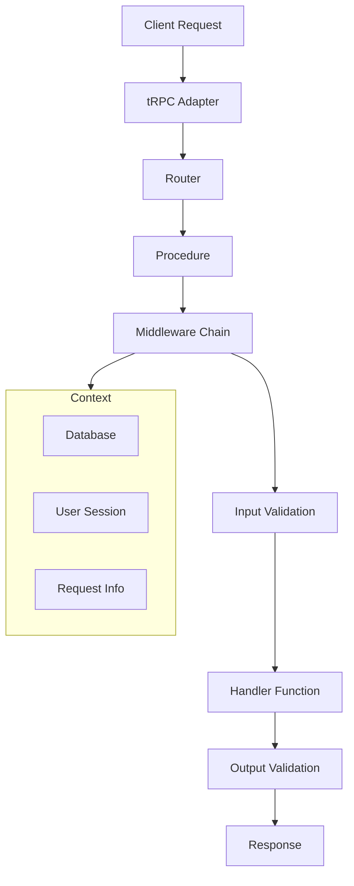

tRPC Server allows you to build fully typesafe APIs without schemas or code generation. Define your API procedures once, and get end-to-end type safety from server to client.

## What is tRPC Server?

tRPC Server is the backend portion of tRPC that handles:

- **API Definition**: Define procedures, routers, and validation schemas
- **Request Handling**: Process incoming requests with full type safety
- **Context Management**: Share data across procedures (database connections, user sessions)
- **Middleware**: Add authentication, logging, and custom logic
- **Error Handling**: Structured error responses with proper HTTP status codes

## Core Features

<Cards>
  <Card icon={<IconCode />} title="Type-Safe Procedures">
    Define queries and mutations with automatic TypeScript inference for inputs
    and outputs.
  </Card>
  <Card icon={<IconShield />} title="Input Validation">
    Built-in support for Zod, Yup, and other validation libraries to ensure data
    integrity.
  </Card>
  <Card icon={<IconPuzzle />} title="Flexible Middleware">
    Add authentication, logging, rate limiting, and custom logic with composable
    middleware.
  </Card>
  <Card icon={<IconPlug />} title="Framework Agnostic">
    Deploy on Express, Fastify, Next.js, or any Node.js server with adapters.
  </Card>
</Cards>

## Quick Server Setup

<Tabs items={['Basic Router', 'With Validation', 'With Middleware']}>
  <Tab value="Basic Router">
    ```typescript title="server/router.ts"
    import { initTRPC } from '@trpc/server';
    
    const t = initTRPC.create();
    
    export const appRouter = t.router({
      hello: t.procedure.query(() => {
        return { message: 'Hello from tRPC!' };
      }),
      
      createUser: t.procedure
        .input(z.object({ name: z.string() }))
        .mutation(({ input }) => {
          // Create user logic
          return { id: '1', name: input.name };
        }),
    });
    
    export type AppRouter = typeof appRouter;
    ```
  </Tab>
  <Tab value="With Validation">
    ```typescript title="server/router.ts"
    import { initTRPC } from '@trpc/server';
    import { z } from 'zod';
    
    const t = initTRPC.create();
    
    export const appRouter = t.router({
      getUser: t.procedure
        .input(z.object({
          id: z.string().uuid(),
        }))
        .output(z.object({
          id: z.string(),
          name: z.string(),
          email: z.string().email(),
        }))
        .query(async ({ input }) => {
          const user = await getUserById(input.id);
          return user;
        }),
    });
    ```
  </Tab>
  <Tab value="With Middleware">
    ```typescript title="server/router.ts"
    import { initTRPC, TRPCError } from '@trpc/server';
    
    const t = initTRPC.context<Context>().create();
    
    const protectedProcedure = t.procedure.use(({ ctx, next }) => {
      if (!ctx.user) {
        throw new TRPCError({ code: 'UNAUTHORIZED' });
      }
      return next({ ctx: { user: ctx.user } });
    });
    
    export const appRouter = t.router({
      profile: protectedProcedure.query(({ ctx }) => {
        return ctx.user; // Type-safe authenticated user
      }),
    });
    ```
  </Tab>
</Tabs>

## Architecture Overview



## Server Components

### Procedures

The building blocks of your API - individual functions that handle requests.

- **Queries**: For reading data (GET-like operations)
- **Mutations**: For writing data (POST/PUT/DELETE-like operations)
- **Subscriptions**: For real-time data streams

### Routers

Organize and group your procedures into logical collections.

### Context

Share data across all procedures like database connections and user sessions.

### Middleware

Add cross-cutting concerns like authentication, logging, and validation.

### Adapters

Deploy your tRPC router on different platforms and frameworks.

## Common Patterns

<Accordions>
  <Accordion title="Authentication & Authorization">
    Use middleware to check user authentication and add user context to procedures.
    
    ```typescript
    const authMiddleware = t.middleware(({ ctx, next }) => {
      if (!ctx.user) {
        throw new TRPCError({ code: 'UNAUTHORIZED' });
      }
      return next({ ctx: { user: ctx.user } });
    });
    ```
  </Accordion>
  <Accordion title="Input & Output Validation">
    Use schema validation libraries like Zod to ensure data integrity.
    
    ```typescript
    const userSchema = z.object({
      name: z.string().min(2),
      email: z.string().email(),
      age: z.number().min(0).max(120),
    });
    
    const createUser = t.procedure
      .input(userSchema)
      .mutation(({ input }) => {
        // input is fully typed and validated
      });
    ```
  </Accordion>
  <Accordion title="Error Handling">
    Use structured errors with proper HTTP status codes.
    
    ```typescript
    throw new TRPCError({
      code: 'NOT_FOUND',
      message: 'User not found',
      cause: originalError,
    });
    ```
  </Accordion>
</Accordions>

## Next Steps

<Cards>
  <Card title="Define Procedures" href="/docs/server/procedures">
    Learn how to create queries, mutations, and subscriptions
  </Card>
  <Card title="Organize with Routers" href="/docs/server/routers">
    Structure your API with nested routers
  </Card>
  <Card title="Add Context" href="/docs/server/context">
    Share data like database connections across procedures
  </Card>
  <Card title="Use Middleware" href="/docs/server/middlewares">
    Add authentication, logging, and validation
  </Card>
</Cards>

<Callout title="Ready to deploy?">
  Once you've built your API, check out our [adapters](/docs/server/adapters) to
  deploy on Express, Fastify, Next.js, or other platforms.
</Callout>
