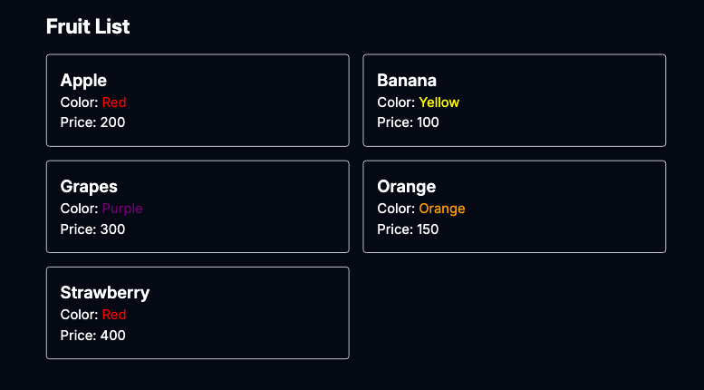
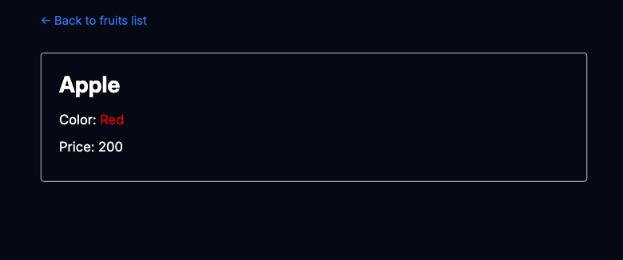
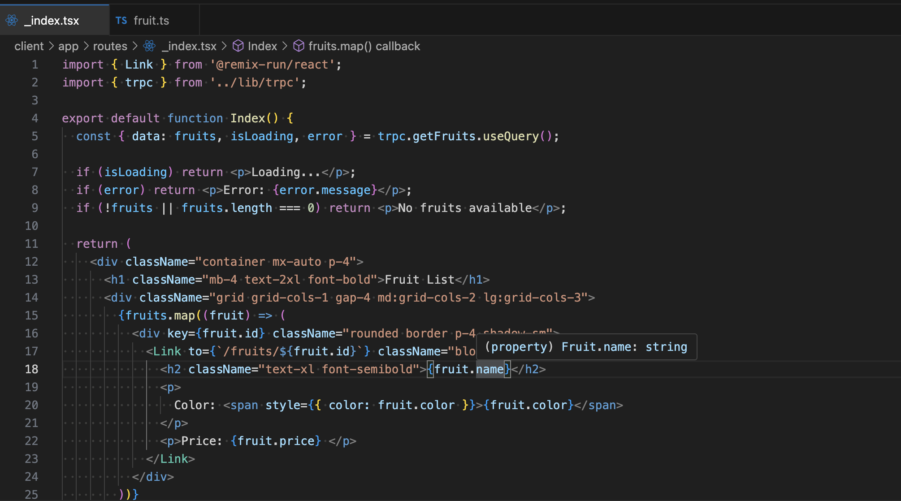

# Remix tRPC Example

This example demonstrates how to use tRPC with Remix, showing best practices for setting up type-safe API communication between your client and server.

## Features

- **Monorepo setup** with client (Remix) and server (Express + tRPC) packages
- **Type-safe API calls** using tRPC's inferred types
- **Dual rendering approaches**:
  - Client-side rendering (CSR) for the index page
  - Server-side rendering (SSR) for detail pages
- **Proper error handling** in both CSR and SSR contexts
- **Responsive UI** with Tailwind CSS

## Project Structure

```
remix-trpc/
├── client/              # Remix application
│   ├── app/
│   │   ├── lib/
│   │   │   └── trpc.ts  # tRPC client setup
│   │   ├── routes/
│   │   │   ├── _index.tsx         # CSR example
│   │   │   └── fruits.$id.tsx     # SSR example
│   │   └── ...
├── server/              # Express + tRPC server
│   ├── src/
│   │   ├── models/      # Data models
│   │   ├── routes/      # tRPC route implementations
│   │   └── trpc/        # tRPC router setup
│   └── ...
└── ...
```

## Getting Started

1. Clone the repository
2. Install dependencies:
   ```bash
   pnpm install
   ```
3. Start the development server:
   ```bash
   pnpm dev
   ```
4. Open your browser at `http://localhost:5173/`

## Screenshots

### 📦 UI Demo






### ✅ Type Safety Example (tRPC)

Client-side type error when using wrong type:



Type completion powered by server definition:


## Key Implementation Details

### Client-Side Rendering (CSR)

The index page (`_index.tsx`) demonstrates client-side data fetching using tRPC's React Query integration:

```tsx
const { data: fruits, isLoading, error } = trpc.getFruits.useQuery();
```

This approach is perfect for:
- Interactive dashboards
- Pages that update frequently
- When you need React Query's powerful features like caching and refetching

### Server-Side Rendering (SSR)

The detail page (`fruits.$id.tsx`) shows how to use tRPC with Remix's loader functions:

```tsx
// Server-side
export async function loader({ params }: LoaderFunctionArgs) {
  const helpers = createServerSideHelpers({
    router: appRouter,
    ctx: {},
    transformer: superjson,
  });
  const fruit = await helpers.getFruitById.fetch(id);
  return { fruit };
}

// Client-side
export default function FruitDetail() {
  const { fruit } = useLoaderData<typeof loader>();
  // ...
}
```

SSR is beneficial for:
- SEO-critical pages
- Initial load performance
- Pages where immediate data availability is important

## Type Safety Across the Stack

One of the main benefits of this setup is end-to-end type safety:

1. Define your API procedures on the server
2. Get fully typed procedures on the client automatically
3. Enjoy autocompletion and type checking for API calls

## Contributing

Feel free to submit issues or pull requests to improve this example.