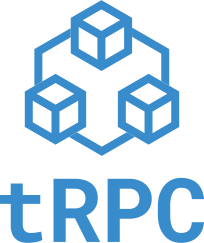

<p align="center">
  <a href="https://trpc.io/"></a>
</p>

<p align="center">
  <strong>End-to-end typesafe APIs made easy</strong>
</p>

<p align="center">
  
</p>

# `@trpc/client`

> Communicate with a tRPC server on the client side.

## Documentation

Full documentation for `@trpc/client` can be found [here](https://trpc.io/docs/vanilla)

## Installation

```bash
# npm
npm install @trpc/client@next

# Yarn
yarn add @trpc/client@next

# pnpm
pnpm add @trpc/client@next
```

## Basic Example

```ts
import { createTRPCClient, createTRPCClientProxy } from '@trpc/client';
// Importing the router type from the server file
import type { AppRouter } from './server';

// Initializing the tRPC client
const client = createTRPCClient<AppRouter>({
  url: 'http://localhost:2022',
});

// Creating a proxy, this allows for cmd+click to the backend function.
const proxy = createTRPCClientProxy(client);

async function main() {
  // Querying the greeting
  const helloResponse = await proxy.greeting.query({
    name: 'world',
  });

  console.log('helloResponse', helloResponse); // Hello world
}

main();
```
