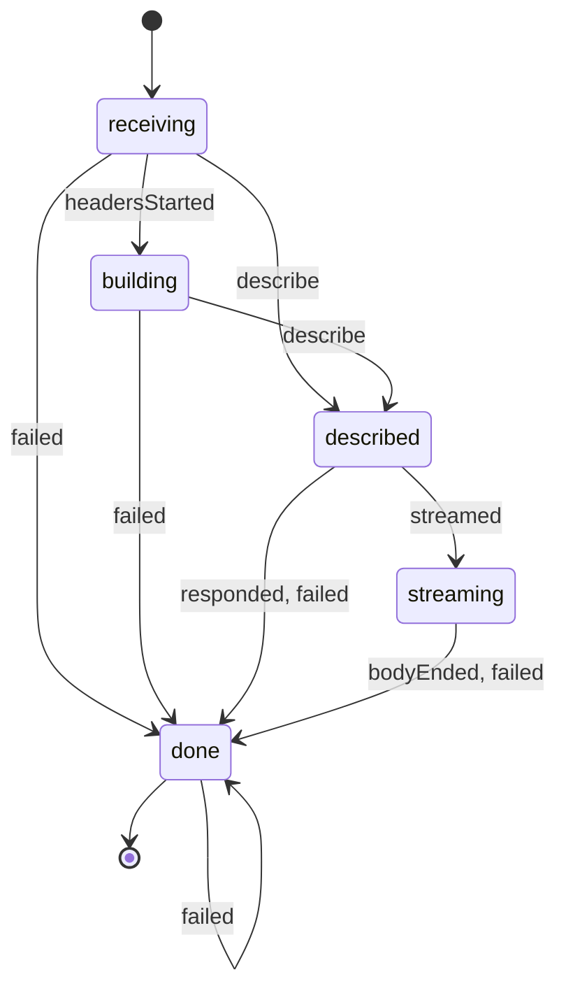

```mermaid
stateDiagram-v2
  [*] --> receiving
  receiving --> building : headersStarted
  receiving --> described : describe
  receiving --> done : failed
  building --> described : describe
  building --> done : failed
  described --> done : responded, failed
  described --> streaming : streamed
  streaming --> done : bodyEnded, failed
  done --> done : failed
  done --> [*]
```
